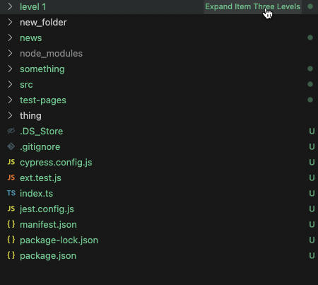

This is a vscode extension that serves as a minimal reproducible example for this bug: [`treeView.reveal` with `expand: 3` only expands the first level 3 folder · Issue #181889 · microsoft/vscode](https://github.com/microsoft/vscode/issues/181889)

Here we see that if you click on "Expand Three Levels" once only be level three folders after the first level two expand. If we click again the rest expand.

Expanding a large folder like node_modules will also make that the promise never fulfills.
